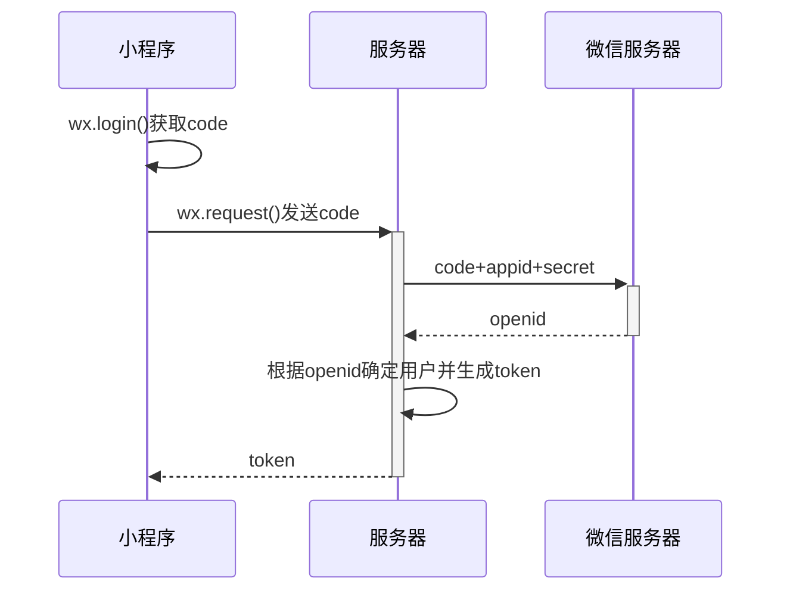
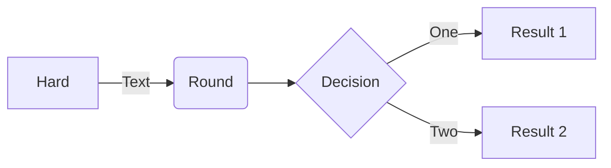

测试摘要！！

<!-- more -->

## 标题一

你好，世界！

## 代码一

```shell
echo "hello world!!"
```

## 表格一

| 标题1 | 标题2 | 标题3 |
| :---: | :---- | ----- |
|   1   | 1     | 1     |
|   2   | 2     | 2     |
|   3   | 3     | 3     |

## 流程图






```flow
st=>start: Start:> http://www.google.com[blank]
e=>end: End :>http://www.google.com
op1=>operation: My Operation
sub1=>subroutine: My Subroutine
cond=>condition: Yes
or No?:>http://www.google.com
io=>inputoutput: catch something...
para=>parallel: parallel tasks

st->op1->cond
cond(yes)->io->e
cond(no)->para
para(path1, bottom)->sub1(right)->op1
para(path2, top)->op1
```


```flow
st=>start: Start|past:>http://www.google.com[blank]
e=>end: End:>http://www.google.com
op1=>operation: My Operation|past
op2=>operation: Stuff|current
sub1=>subroutine: My Subroutine|invalid
cond=>condition: Yes
or No?|approved:>http://www.google.com
c2=>condition: Good idea|rejected
io=>inputoutput: catch something...|request

st->op1(right)->cond
cond(yes, right)->c2
cond(no)->sub1(left)->op1
c2(yes)->io->e
c2(no)->op2->e
```
